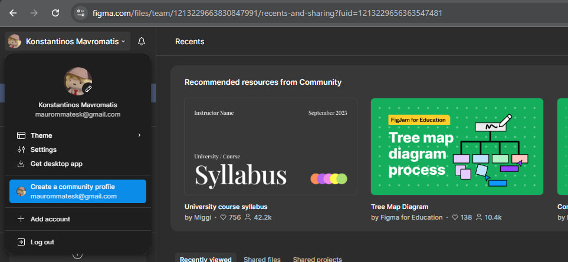
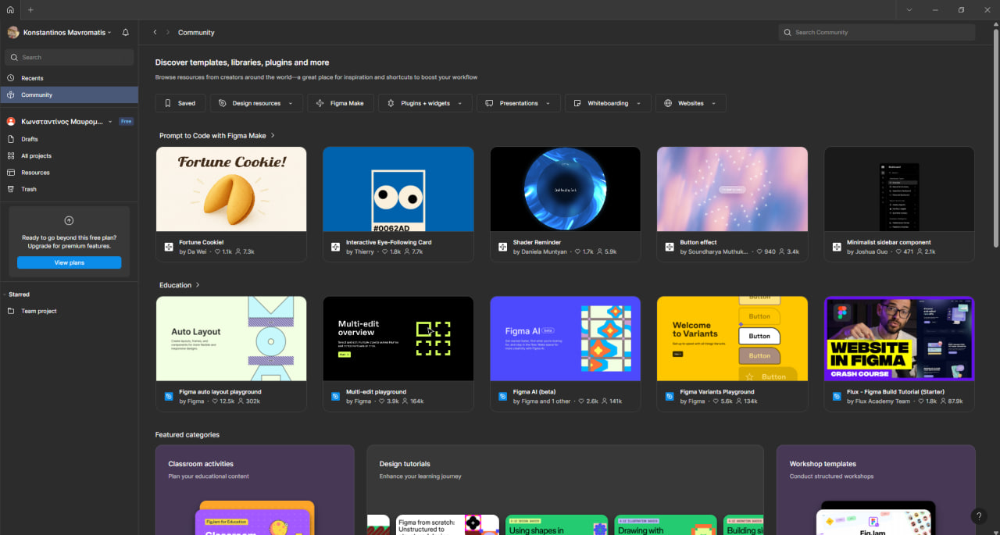
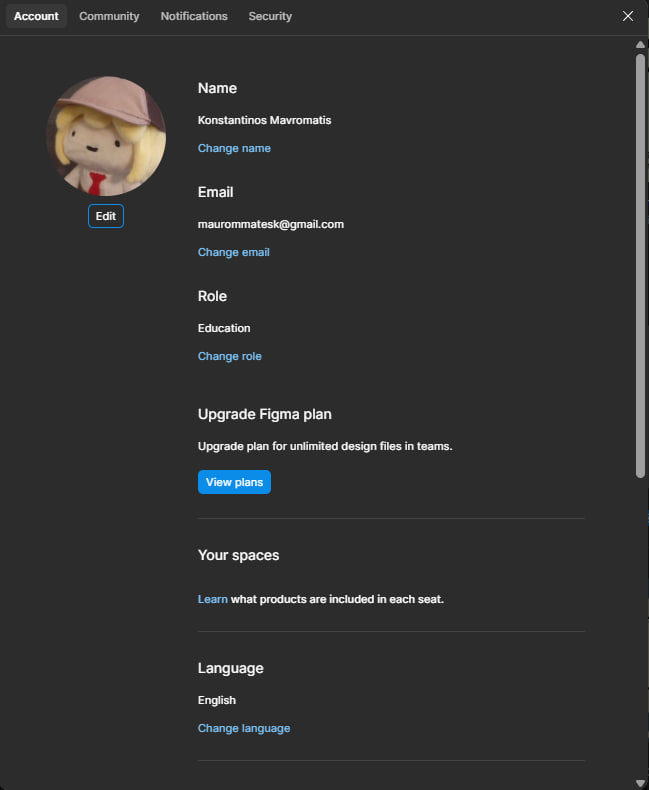

# **Практичне заняття 1 – Огляд сервісів для прототипування**

## **Хід роботи:**
Для того щоб завантажити декстопну версію Figma треба 
зайти на сайт https://www.figma.com після того як ви зареструєтесь, 
вам відчинеться веб-версія додатку де ви зможете працювати саме в 
браузері. Клацнувши на свою іконку користувача в лівому верхньому 
куту вам відкриється можливість відреагувати свій профіль та завантажити
декстопну версію.

### *Як вигляжає веб-версія:*

### *Як виглядає десктопна версія:* 

### *Зареєстрований акаунт з ім'ям:*

## **Висновки:** 
* Навчився оформлювати та структурувати завдання у GitHub, використовуючи Markdown-файли (readme.md).
* Отримав практичний досвід роботи з оформленням тексту, зображень та посилань у Markdown.
* Зареєструвався у Figma та ознайомився з її веб- та десктопною версіями, що дозволяє ефективніше працювати з прототипуванням.
