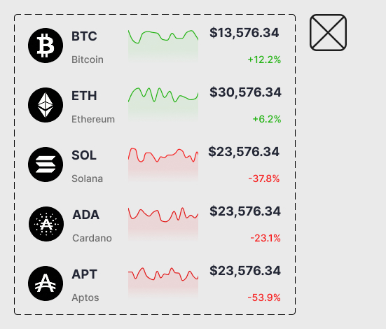

# Practical task 10. Components and Variants in Figma (Mobile App)

## Workflow

The goal of this task was to **design a mobile interface for a Cryptocurrency Investment App**, focusing on creating a reusable system of components.
The task required using **Figma Components and Variants** to ensure consistency across different screens (Dashboard and Coin Details).

In accordance with the task, I developed a dark-mode mobile UI.
My main tools were: **Figma** (Auto Layout, Component Properties, Constraints).

The work focused on:
1.  **Atomic Design:** Creating small, reusable elements (buttons, list items).
2.  **Organization:** Using Auto Layout to manage spacing in dynamic lists.
3.  **Prototyping:** Assembling the screens using instances of the master components.

---

### 1) **Designing the Component Base**
*I started by creating the building blocks. This includes the asset list rows (Logo, Graph, Price) and interactive elements.*

*Here I defined the structure of the crypto asset row, ensuring the graph and text align correctly:*

  

*I also created a set of interactive elements, including time-frame selectors (D/W/M) and Buy/Sell action buttons:*

  

---

### 2) **Final UI: Dashboard Screen**
*Using the components created above, I assembled the main "Home" screen. The "Crypto assets" list is built using multiple instances of the row component shown in step 1.*

  

---

### 3) **Final UI: Coin Detail Screen**
*The second screen details a specific asset (Bitcoin). I reused the button components and typography styles to maintain visual consistency with the main screen.*

  

---

### *Link to Figma project:*
https://www.figma.com/design/BHPnyhDk6lZMdTybGBrXGZ/Practice-10--11--12?node-id=0-1&t=HKauQvC0qqfmRVhK-1

 

### *Path to the file in the repository:*
`Figma_file/Practice_10_11_12.fig`

---

## Conclusions

This task allowed me to deepen my understanding of **Mobile UI Design** in Figma.
I learned how to:
1.  **Work with Dark Mode:** carefully selecting colors and contrasts for a financial app.
2.  **Master Components:** Building a complex list item (Asset Row) once and reusing it for Bitcoin, Ethereum, Solana, etc., simply by overriding text and icons.
3.  **Maintain Consistency:** Using the same button styles and fonts across different screens ensures a professional look and feel.

This workflow demonstrates the efficiency of using Components and Auto Layout for mobile app design.