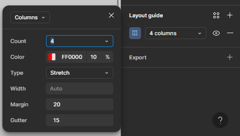
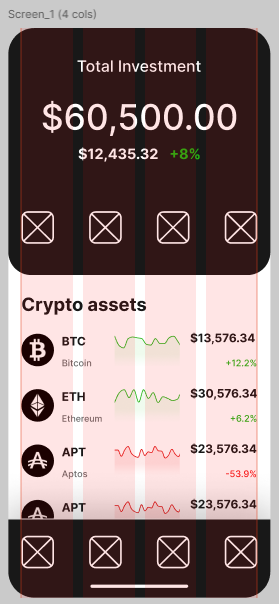

# Practical task 11. Grids in Interface Design

## Workflow

The goal of this task was to **master the use of Layout Grids in mobile UI design**.
The task required setting up a responsive grid system to ensure proper alignment, consistent margins, and structured spacing for a **Cryptocurrency Mobile App**.

In accordance with the task, I developed a 4-column grid system suitable for mobile screens.
My main tools were: **Figma** (Layout Grid, Constraints, Guides).

The work focused on:
1.  **Grid Setup:** Configuring a 4-column layout with specific margins and gutters.
2.  **Alignment:** Placing elements (text, charts, buttons) strictly within the column boundaries.
3.  **Consistency:** Ensuring the same grid structure is applied across different screens (Dashboard vs. Details).

---

### 1) **Grid Configuration**
*I established a 4-column grid, which is the standard for mobile interfaces. This provides enough flexibility to divide content into halves (2 columns) or full width (4 columns).*

* **Count:** 4 Columns
* **Margin:** 20px (Safe zone from the screen edges)
* **Gutter:** 15px (Space between columns)

  

---

### 2) **Main Dashboard Screen**
*The alignment process for the home screen. The "Total Investment" block and the list of assets are aligned to the outer edges of the grid.*

**Grid View (Structure):**

  

**Final View (Clean UI):**

  

---

### 3) **Coin Detail Screen**
*Applying the same grid logic to the detailed view. Notice how the chart and the "Buy/Sell" buttons span exactly across the columns to maintain visual balance.*

**Grid View (Structure):**

  

**Final View (Clean UI):**

  

---

### *Link to Figma project:*
https://www.figma.com/design/BHPnyhDk6lZMdTybGBrXGZ/Practice-10--11--12?node-id=12-99&t=HKauQvC0qqfmRVhK-1

 

### *Path to the file in the repository:*
`Figma_file/Practice_10_11_12.fig`

---

## Conclusions

This task allowed me to understand the importance of **Layout Grids** in creating professional interfaces.
I learned how to:
1.  **Establish Structure:** Using a 4-column grid eliminates guesswork when placing elements.
2.  **Ensure Responsiveness:** By adhering to the grid, elements like the graph and buttons naturally adapt to the screen width.
3.  **Maintain Visual Rhythm:** Consistent margins and gutters make the app feel cohesive as the user navigates between screens.

This workflow proves that a strict grid system is the foundation of clean and organized mobile design.