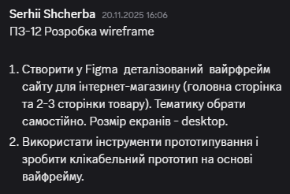
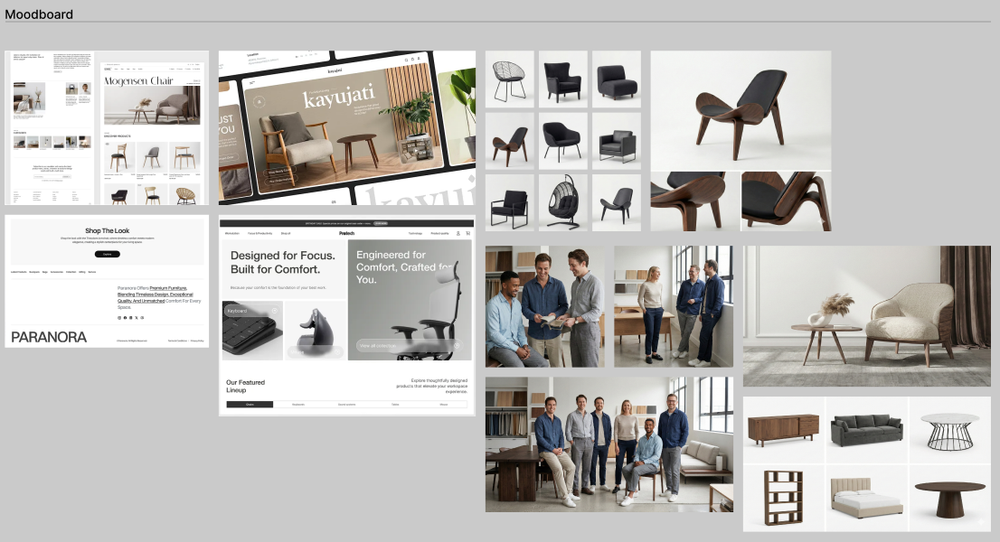
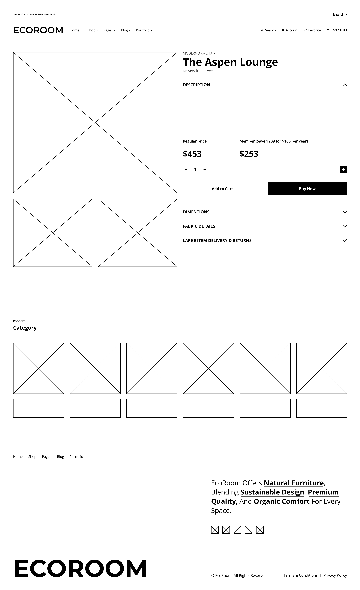
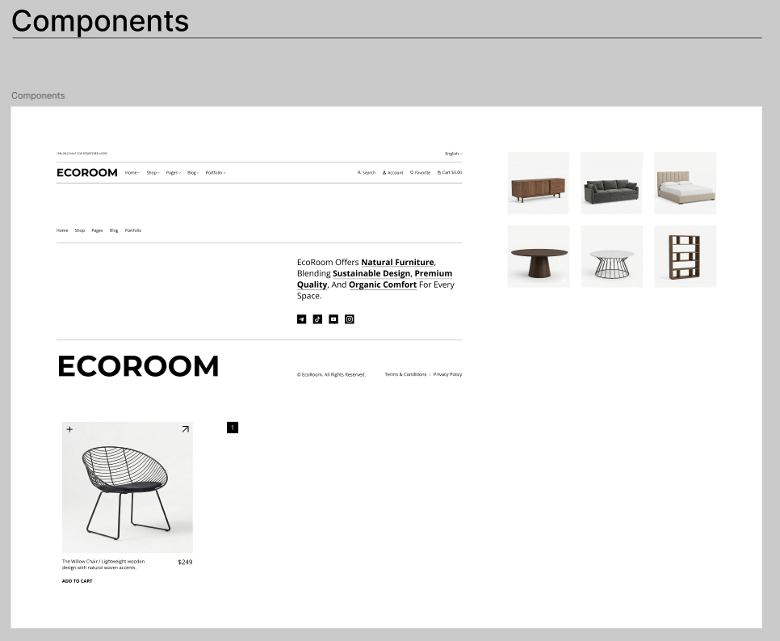
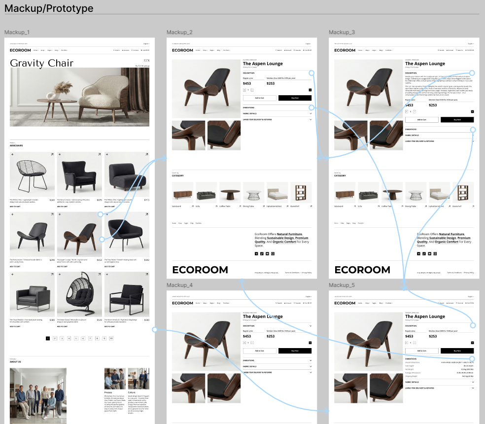

# Practical Task 12. Developing Wireframes and Prototypes

## Workflow

The goal of this task was to **design a comprehensive user experience for an online furniture store** called "ECOROOM". The process involved moving from initial research and structural planning to high-fidelity visual design and finally connecting the screens into an interactive prototype.

My main tools were: **Figma** (Design, Wireframing, Prototyping, Auto Layout).

The work focused on:
1.  **Research:** Gathering visual references.
2.  **Structure:** Building low-fidelity wireframes to define layout.
3.  **System:** Creating reusable components for consistency.
4.  **UI Design:** Applying a clean, minimalist aesthetic suitable for premium furniture.
5.  **Prototyping:** linking screens to simulate the user purchase flow.

---

### 1) **Task Requirements**
*The objective was to create a wireframe, a clickable prototype, and a high-fidelity design for a desktop e-commerce site.*

  

---

### 2) **Stage 1: Moodboard & Research**
*Before starting the design, I collected visual references to define the style: minimalist, earthy tones, and spacious layouts emphasizing "Natural Furniture".*

  

---

### 3) **Stage 2: Low-Fidelity Wireframes**
*I designed the skeletal structure of the website to focus on information architecture and spacing without the distraction of colors.*

**Main Catalog Page (Structure):**

  

**Product Details Page (Structure):**

  

---

### 4) **Stage 3: Component System**
*To ensure consistency and speed up the design process, I created a set of reusable components (Navigation, Product Cards, Buttons, and Icons).*

  

---

### 5) **Stage 4: High-Fidelity Mockups**
*Applying the visual style to the wireframes. The final design features high-quality imagery, clear typography, and a clean white background to let the products stand out.*

**Main Page (Final UI):**

  

**Product Page (Final UI):**

  

---

### 6) **Stage 5: Interactive Prototype**
*Finally, I connected the screens using Figma's prototyping tools. The flow demonstrates how a user navigates from the homepage catalog to a specific product page.*

  

---

### *Link to Figma project:*
https://www.figma.com/design/BHPnyhDk6lZMdTybGBrXGZ/Practice-10--11--12?node-id=14-203&t=kQbSer8emU5Sebzy-1

 

### *Path to the file in the repository:*
`Figma_file/Practice_10_11_12.fig`

---

## Conclusions

This task allowed me to simulate a real-world product design workflow.
**Key takeaways:**
1.  **From Abstract to Concrete:** Moving from a Moodboard to Wireframes and then to final UI helps maintain focus and direction.
2.  **Component Efficiency:** Creating the product cards as components made it easy to populate the grid on the main page.
3.  **User Flow:** The prototyping phase helped validate the navigation logic between the catalog and the product details.

The result is a cohesive, user-friendly interface for the "ECOROOM" brand.