# Practical Task 13

## Topic
Exploration of Color Harmonies and Tools in Adobe Color.

## Objectives
1.  Understand the core principles of color harmony and how to combine colors effectively.
2.  Practice creating palettes using the color wheel based on standard harmony rules.
3.  Investigate tools for extracting color themes and gradients from existing images.
4.  Master the verification of color contrast ratios to meet WCAG accessibility standards.
5.  Develop skills in documenting design decisions and color analysis using Markdown.

## Theoretical Overview
**Defining Color Harmony**
Color harmony is the art of combining colors in a way that is pleasing to the human eye. It establishes a sense of order and balance in the visual experience, which is essential for engaging and readable user interfaces.

**Types of Harmonies:**
* **Analogous:** Colors located next to each other on the wheel — creates a smooth, low-contrast look.
* **Monochromatic:** A single hue modified by tints, tones, and shades — unified and clean.
* **Triad:** Three colors positioned at equal distances (120°) — vibrant and balanced.
* **Complementary:** Two colors directly opposite each other — creates maximum contrast.
* **Split Complementary:** One base color paired with the two adjacent to its opposite — strong visual weight but less tension.
* **Square:** Four colors spaced evenly around the wheel — offers a rich variety.
* **Custom:** A manual arrangement — allows for total creative freedom.

**Accessibility (WCAG):**
* **AA Level:** Required for standard text (Contrast ratio ≥ 4.5:1).
* **AAA Level:** Enhanced accessibility (Contrast ratio ≥ 7:1).

---

## Practical Implementation

### 1. Base Color
- **Base Color:** `#817DF4`

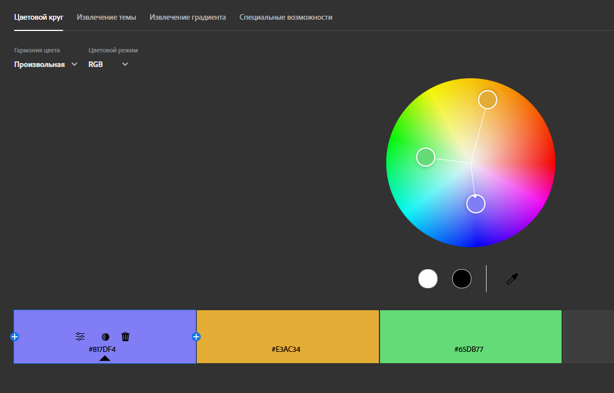

### 2. Palettes by Harmony Type

#### Analogous
- **HEX:** `#A0DB32`, `#37DB4D`, `#5BDC35`, `#DBD837`, `#37DB87`
- **Logic:** Selects colors that are immediate neighbors on the spectrum.

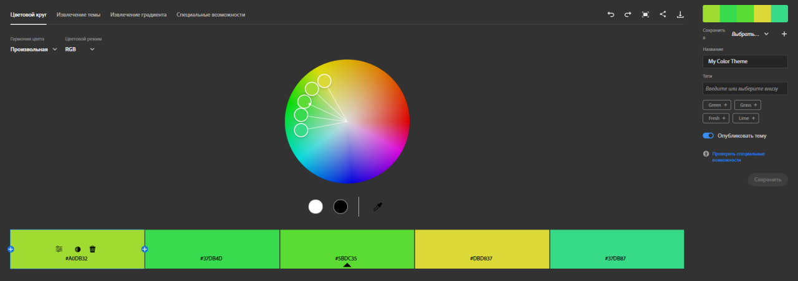

#### Monochromatic
- **HEX:** `#60AB4A`, `#55754B`, `#5CDB35`, `#3A423B`, `#2A3327`
- **Logic:** Utilizes a single hue but varies the lightness and saturation levels.

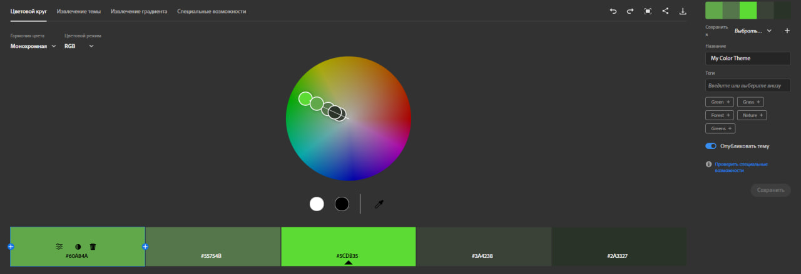

#### Triad
- **HEX:** `#DB6D35`, `#3535DB`, `#5CDB35`
- **Logic:** Connects three colors that form an equilateral triangle on the wheel.

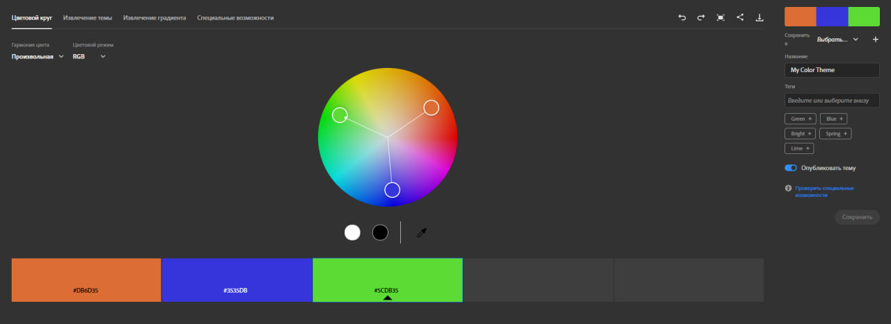

#### Complementary
- **HEX:** `#0EE126`, `#3EA74A`, `#70A776`, `#959192`, `#A27683`, `#DF6489`
- **Logic:** Pairs colors from opposite sides of the color wheel.

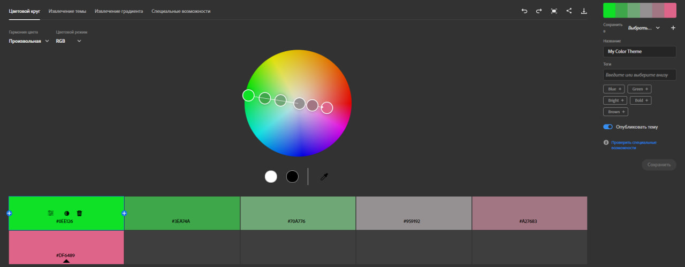

#### Split Complementary
- **HEX:** `#E0321D`, `#613D5B`, `#3D6142`, `#E01DC0`, `#61413D`, `#1CE03B`
- **Logic:** Uses a base color and the two colors adjacent to its direct complement.

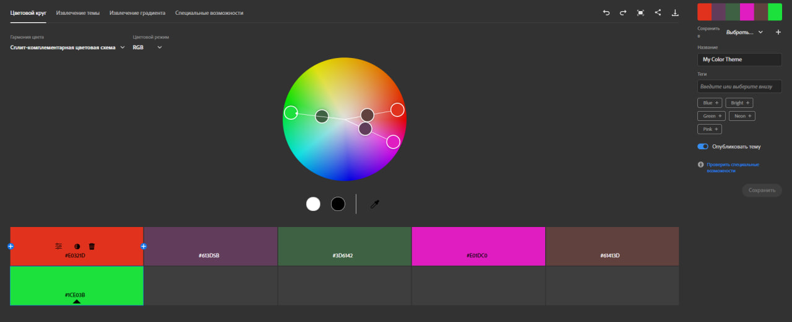

#### Square
- **HEX:** `#E09C1D`, `#615744`, `#1D73E0`, `#E01DA0`, `#698F64`, `#34E01D`
- **Logic:** A four-color scheme where all hues are spaced evenly around the circle.

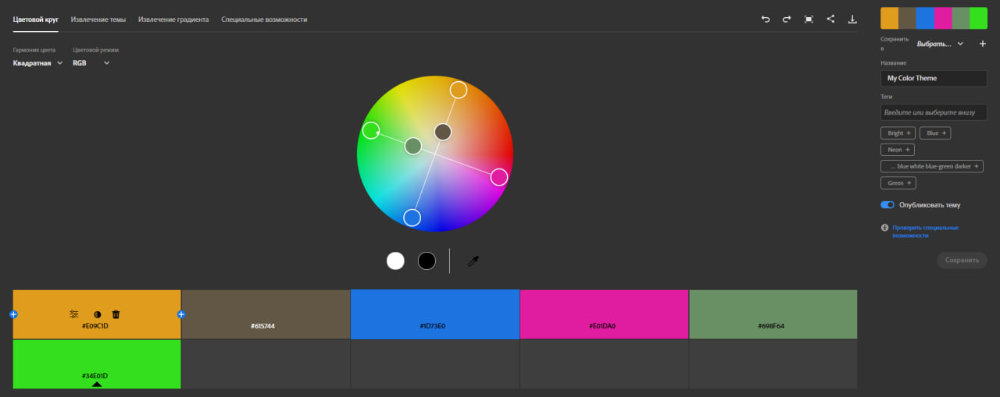

#### Custom
- **HEX:** `#2E85DB`, `#DBD039`, `#BCDA71`, `#7DDC9E`, `#4BDB32`, `#46DCCD`
- **Logic:** A manual selection based on the designer's specific needs rather than a strict geometric rule.

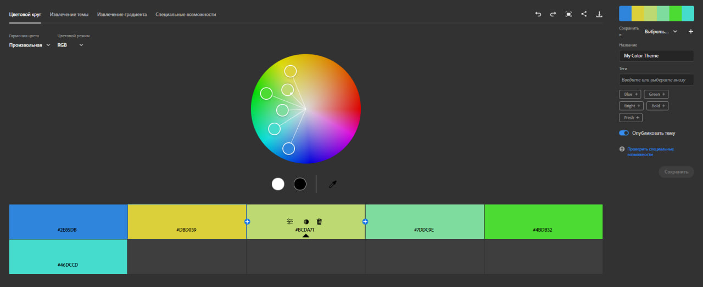

### 3. Extract Theme
**Image used:** 

- **Colorful Palette:**
  - HEXs: `#C7D2D9`, `#BF7E04`, `#A67244`, `#8C1A0F`, `#A69D9C`
  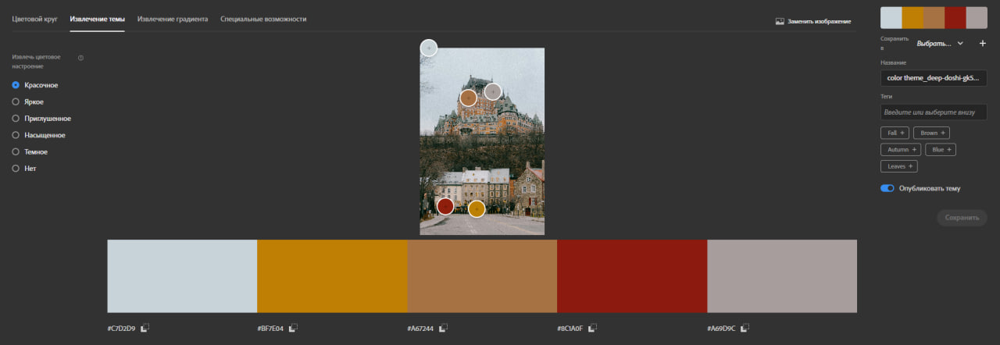

- **Muted Palette:**
  - HEXs: `#C7D2D9`, `#3E4031`, `#BF7E04`, `#A67244`, `#A69D9C`
  

**Which palette fits UI better:** Muted
**Explanation:** The Muted palette is generally more suitable for a user interface background or secondary elements. Its lower saturation reduces eye strain and allows text or call-to-action buttons to stand out more effectively compared to the high-intensity colorful version.

### 4. Extract Gradient
- **Gradient stops:** `#BEC8DQ`, `#2C2E20`, `#847361`
- **Application:** This smooth transition of tones would be suitable for a sophisticated background overlay or a modern footer design.

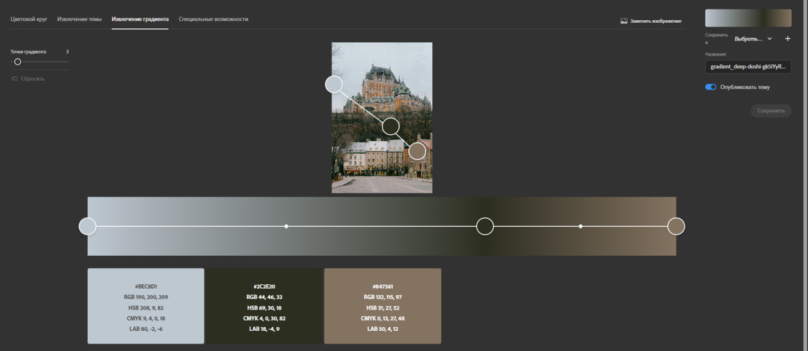

### 5. Accessibility (Contrast)
- **Color Pair:** Background `#EDFFF2`, Text `#2C2E20`
- **Contrast Ratio:** `13.29 : 1`

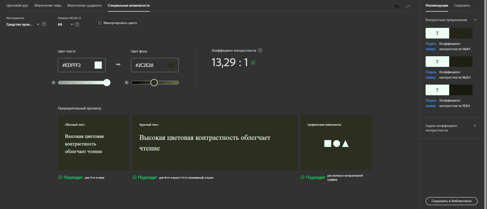

---

## Conclusion
Through this practical assignment, I gained valuable experience using Adobe Color to build effective color schemes. I experimented with various harmony rules, such as Analogous and Triad, observing how they influence the overall atmosphere of a design.

I also mastered the tools for extracting palettes and gradients from images, learning how to choose between muted and colorful themes depending on the interface requirements.

A key part of the work was ensuring accessibility. By achieving a high contrast ratio of 13.29:1 in the test example, I confirmed the importance of adhering to WCAG guidelines to create inclusive and readable user experiences.
