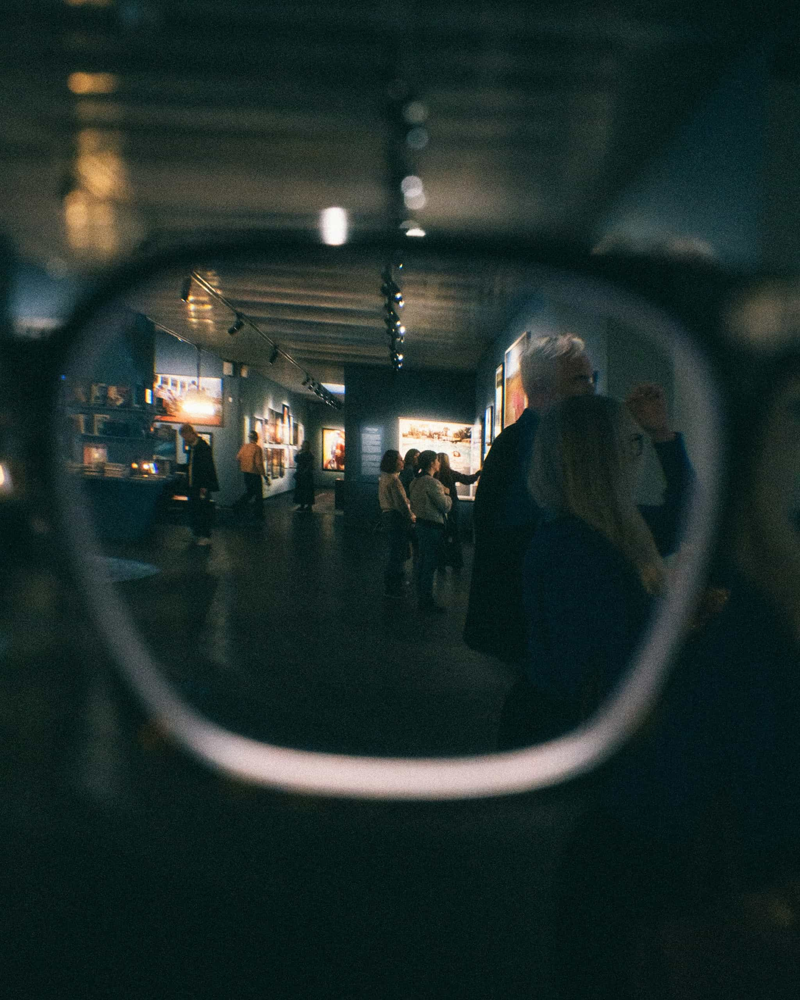
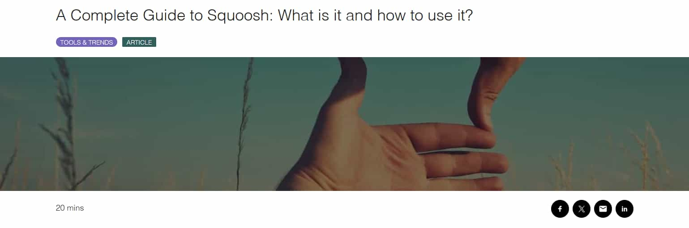

# Workshop_14

## Topic
Image optimization using Squoosh.

## Objective
1. Familiarize with image compression methods and their impact on quality.
2. Learn to determine the optimal balance between image quality and file size.
3. Understand different types of compression: lossless and lossy.
4. Investigate the impact of resizing on image quality and file weight.
5. Learn to adapt images for different target applications:
   - Web (optimization for fast loading).
   - Mobile devices (reduced dimensions, effective compression).
   - Retina displays (2x, 3x versions to preserve quality).
6. Reinforce skills in documenting and analyzing results in Markdown format within a GitHub repository.

## Theoretical Part

**What is Squoosh and how does it work?**
Squoosh is a free online tool for image compression and optimization. It runs directly in the browser and requires no software installation.

**Squoosh Workflow:**
1. The user uploads an image.
2. Selects the format and compression type.
3. Adjusts quality levels, dimensions, etc.
4. Downloads the optimized file to the computer.

### Image Formats and Compression Types

**Lossless Compression**
With this compression, image quality does not deteriorate; only the file size changes.
* **Main Formats:**
    * **PNG:** High-quality lossless format, often used for screenshots and graphics with text.
    * **WebP:** Modern lossless format, lighter than PNG.
* **Pros:** Full preservation of quality.
* **Cons:** File size is larger compared to lossy compression.

**Lossy Compression**
With this compression, some image details are lost, but the file size is significantly reduced.
* **Main Formats:**
    * **MozJPEG:** Optimized JPEG for the web.
    * **WebP (lossy):** Modern format with a good balance of quality and size.
    * **AVIF:** Newest format with very strong compression.
* **Pros:** Very small file size.
* **Cons:** Artifacts may appear at low quality settings.

### Image Resizing and Its Impact
**Resize** refers to reducing or increasing the width and height of an image.
* **Reducing size:** The file becomes significantly lighter, loads faster on websites, and quality loss is minimal.
* **Increasing size:** Sharpness may deteriorate, and the file becomes heavier.
* **Web Recommendation:** Do not upload images larger than necessary for display on the screen.

### Optimization for Retina Displays
Retina displays have high pixel density. If a standard 1x image is shown, it looks blurry. Therefore, specific versions are used:
* **2x:** Twice as large.
* **3x:** Three times as large.

### Adaptive Images in Web (srcset)
`srcset` is a special HTML attribute that allows the browser to automatically select the appropriate image version based on:
* Screen size.
* Pixel density.
* Device type.

Thanks to `srcset`, lightweight photos load on weaker devices, while high-quality ones load on Retina screens, making the site faster and more efficient.

---

## 1. Initial Images

| Type | File | Format | Size |
|------|--------|--------|--------|
| Photo | Look.jpg | JPG | 1.59 MB |
| Screenshot | Screenshot.png | PNG | 252 KB |
| Graphics with text | Text.png | PNG | 6.31 KB |

---

## 2. Lossless Compression

### Photo
- PNG → 7.31 MB → `Look_OxiPNG_lossless.png`
- WebP → 2.89 MB → `Look_WebP.webp`

### Screenshot
- PNG → 190 KB → `Screenshot_OxiPNG_lossless.png`
- WebP → 59.4 KB → `Screenshot_WebP.webp`

### Graphics
- PNG → 3.24 KB → `Some_Text_OxiPNG_lossless.png`
- WebP → 3.09 KB → `Some_Text_WebP.webp`

---

## 3. Lossy Compression

### Photo

| Format | 100% | 75% | 50% |
|--------|------|------|------|
| MozJPEG | 4.30 MB | 653 KB | 292 KB |
| WebP | 2.89 MB | 1.01 MB | 708 KB |
| AVIF | 2.63 MB | 1.28 MB | 655 KB |

### Screenshot

| Format | 100% | 75% | 50% |
|--------|------|------|------|
| MozJPEG | 177 KB | 28.3 KB | 18.5 KB |
| WebP | 59.4 KB | 18.2 KB | 14.4 KB |
| AVIF | 64.2 KB | 17.1 KB | 9.41 KB |

### Graphics

| Format | 100% | 75% | 50% |
|--------|------|------|------|
| MozJPEG | 703 B | 516 B | 644 B |
| WebP | 3.09 KB | 3.10 KB | 3.10 KB |
| AVIF | 4.63 KB | 4.0 KB | 3.28 KB |

---

## 4. Resizing

### Photo

| Version | File | Size |
|--------|--------|--------|
| Mobile 600px | Look_bJPEG_600.jpg | 439 KB |
| Web 1200px | Look_bJPEG_1200.jpg | 1.81 MB |
| Retina x2 | Look_bJPEG_(retina_x2).jpg | 4.89 MB |

### Screenshot

| Version | File | Size |
|--------|--------|--------|
| Mobile 600px | Screenshot_bJPEG_600.jpg | 17.0 KB |
| Web 1200px | Screenshot_bJPEG_1200.jpg | 46.5 KB |
| Retina x2 | Screenshot_bJPEG_(retina_x2).jpg | 170 KB |

### Graphics

| Version | File | Size |
|--------|--------|--------|
| Mobile 600px | Some_Text_bJPEG_600.jpg | 1.07 KB |
| Web 1200px | Some_Text_bJPEG_1200.jpg | 2.05 KB |
| Retina x3 | Some_Text_bJPEG_(retina_x3).jpg | 3.87 KB |

---

## 5. Image Comparison

### Photo

#### Original

#### Optimized (Moz JPEG 50%)

---

### Screenshot

#### Original

#### Optimized (Moz JPEG 50%)

---

### Graphics with text

#### Original

#### Optimized (Moz JPEG 50%)

*Comparison:*  
The optimization process using MozJPEG at 50% quality demonstrated a significant reduction in file size, but the visual impact varied greatly between the two image types.

For the Photograph ("Look"), the compression was highly effective. The algorithm handled the complex lighting and dark tones of the museum scene well, preserving the overall atmosphere and depth with very little visible quality loss.

However, for the Text Graphic ("Some_Text"), the result was unsatisfactory for two main reasons. First, since the JPEG format does not support transparency (alpha channels), the transparent background was automatically replaced with a solid black fill. Second, noticeable compression artifacts ("ringing" noise) appeared around the sharp edges of the white letters, reducing clarity. This confirms that while MozJPEG is excellent for photos, it is unsuitable for graphics requiring transparency or sharp typography.

## Conclusion

This workshop provided valuable hands-on experience with the Squoosh tool, allowing me to master various image optimization techniques. I explored the practical differences between lossy and lossless compression and learned how to properly resize images to fit different screen resolutions.

A key takeaway was the impressive efficiency of modern formats like WebP and AVIF, which significantly reduce file weight without compromising visual quality. I concluded that while these formats are ideal for general web usage, PNG remains the go-to standard for screenshots and graphics where preserving sharp details is a priority. Furthermore, I reinforced the importance of generating high-density versions (2x, 3x) to ensure images look crisp on Retina displays.
