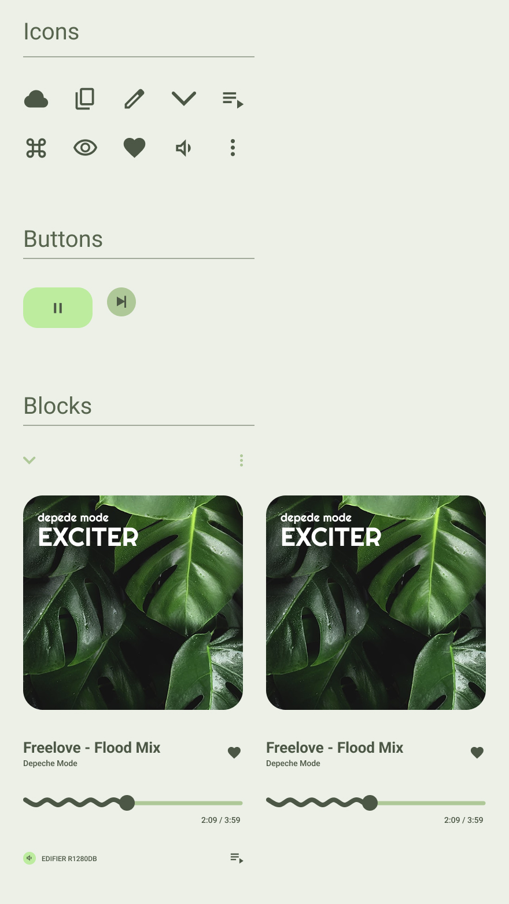

# Practical task 4. Frames, groups, and sections in Figma

## Work process

The main objective of this task was to **accurately recreate a given design** in Figma using frames, groups, and sections.  
The goal was to precisely reproduce the visual structure, spacing, and component hierarchy while maintaining the original style and proportions.

To complete the assignment, I created **three separate frames** to organize icons, buttons, and layout blocks.  
Additionally, I decided to build a **dedicated frame with reusable components** for the mobile application interface — this allowed for better consistency, alignment, and easier further adjustments.

As part of the extra practice, I also recreated the **Google Chrome icon** entirely from vector shapes.  
Using only vector layers, I simulated a **3D-like appearance** by carefully adjusting gradients, shadows, and color overlaps to imitate depth without using raster effects.

All icons were sourced from **Google Material Icons**, and typography was set with **Roboto**, imported from **Google Fonts** as recommended.  
The overall color palette follows a soft green tone for a clean, modern aesthetic aligned with minimalist UI principles.

---

### 1) **Icons and component setup**

 

### 2) **UI elements and component blocks**

 

### 3) **Mobile app frame**

 

### 4) **Final look of the mobile app**

 

### 5) **3D visualization using vector shapes**

.jpg)

---

### *Figma project link:*
[https://www.figma.com/design/qd7KvEsja7bPFiItY3cazZ/Practice-UX-UI?node-id=47-2&t=AC5LiO3kpbUyyc98-1](https://www.figma.com/design/qd7KvEsja7bPFiItY3cazZ/Practice-UX-UI?node-id=47-2&t=AC5LiO3kpbUyyc98-1)

 

### *File path in repository:*
`Figma_file/Practice_UX_UI.fig`

---

## Conclusions

During this practical work, I improved my understanding of **frames, groups, and sections** in Figma and how they help maintain structure in design projects.  
I also practiced building a mobile app layout using reusable **components** and experimented with creating **depth and realism in vector design**.  
The assignment demonstrated how proper layer organization and component hierarchy contribute to efficient design workflows.

