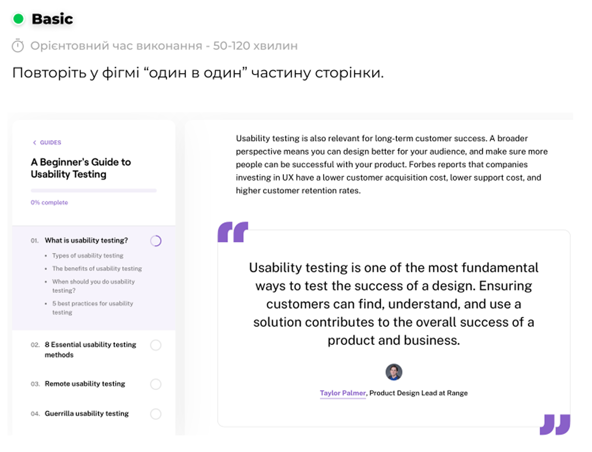

# Practical tasks 7–8. Typography in interface design (Parts 1–2)

## Work process

The purpose of these two tasks was to **study the fundamentals of typography in interface design** and apply this knowledge through practical exercises in Figma.

In **Part 1**, I reviewed the theoretical material from the document  
[*Typography — Figma User Guide, section 9–10*](https://docs.google.com/document/d/1IAKGCHHd1mB2Ecz_xdSHvbygmMeIOiWp-nQBAQz_JlY/edit?usp=sharing)  
to understand the key principles of **font families, text hierarchy, spacing, contrast, and legibility** in digital design.  
The study also covered terms such as:
- **Kerning** – spacing between specific letter pairs;  
- **Tracking** – overall spacing between characters;  
- **Leading (line spacing)** – the vertical distance between lines of text;  
- **Hierarchy** – the system of organizing text by size, weight, and position to emphasize importance.  

In **Part 2**, based on the video tutorial  
[*Typography in UI Design (YouTube)*](https://www.youtube.com/watch?v=VouVsut_-Ak&authuser=0),  
I recreated the provided Figma layout from the file **figma 3**, focusing on visual consistency and text alignment.

For this assignment, I created two main frames:  
- **“Typography assignment”** — where I replicated the structure and hierarchy of text elements, ensuring consistent spacing, font pairing, and alignment.  
- **“Task”** — where I applied typographic principles in a practical composition, demonstrating readability, balance, and appropriate contrast.

The goal was to reproduce the layout **exactly as provided**, maintaining consistent proportions, margins, and typographic rhythm.

---

### 1) **Typography layout assignment**

  

---

### 2) **Final task composition**

  

---

### *Figma project link:*
[https://www.figma.com/design/qd7KvEsja7bPFiItY3cazZ/Practice-UX-UI?node-id=0-1&t=kGTf3erfKpAyZ6lV-1](https://www.figma.com/design/qd7KvEsja7bPFiItY3cazZ/Practice-UX-UI?node-id=0-1&t=kGTf3erfKpAyZ6lV-1)

 

### *File path in repository:*
`Figma_file/Practice_UX_UI.fig`

---

## Conclusions

These two tasks helped me understand **how typography defines the visual language of interfaces**.  
I learned how to structure text blocks using proper hierarchy, line height, and kerning to enhance readability.  
By practicing in Figma, I reinforced my ability to apply **font combinations, contrast, and alignment** principles that ensure clarity and usability in UI design.  
This assignment emphasized that typography is not just about text — it is an essential part of the overall **user experience** and **visual communication**.

---
